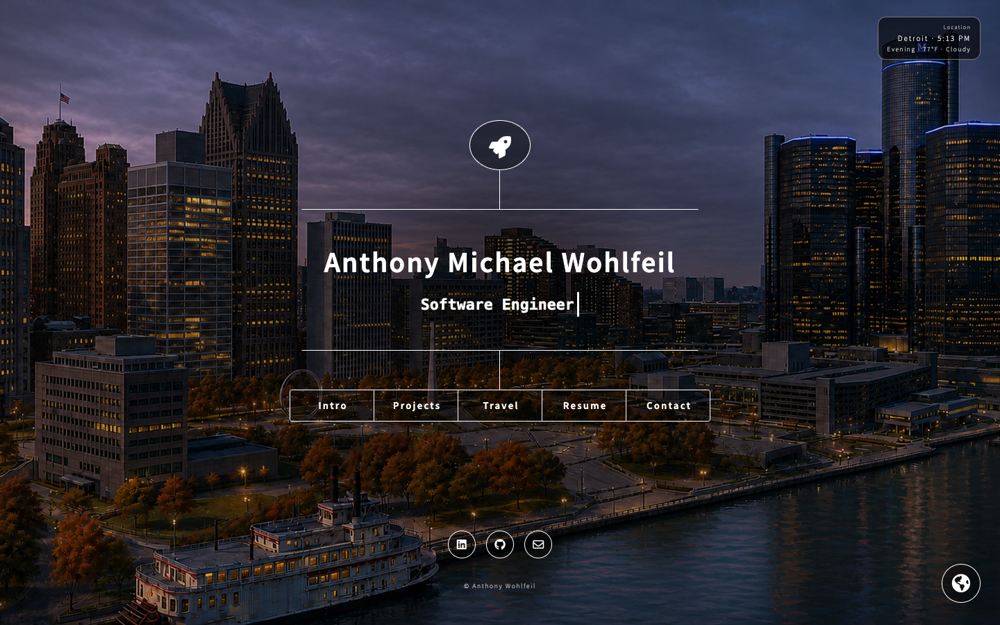
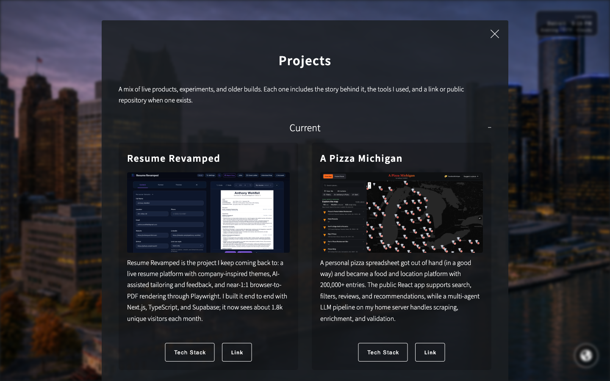

# Anthony Wohlfeil

[anthonywohlfeil.com](https://anthonywohlfeil.com) is my personal website. It is part portfolio, part travel log, and a place for me to keep experimenting with frontend work.

The site started from an HTML5 UP template when I was first learning HTML and CSS. I have gradually rebuilt it around my own projects, resume, travel history, and a few smaller experiments.

<p align="center">
  <a href="https://anthonywohlfeil.com">
    
  </a>
  <a href="https://anthonywohlfeil.com/#projects">
    
  </a>
</p>

## Project overview

- Current projects and older work going back to college
- Resume variants made with [Resume Revamped](https://resumerevamped.com)
- A travel log and interactive map
- Seasonal city backgrounds based on location, local time, and weather

The background image sets are generated and reviewed with my public [Multi-Take Image Generation Pipeline](https://github.com/Antwohlf/multi-take-image-generation-pipeline). The site chooses from the approved images using the selected city, season, time of day, and current weather.

## Development

The site is plain HTML, CSS, and JavaScript with no build step.

```bash
python3 -m http.server 8000
```

The original layout was based on [Dimension by HTML5 UP](https://html5up.net/dimension).
